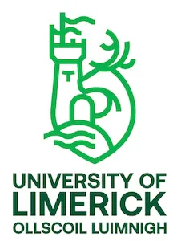

Bayesian deconvolution pipeline recovering cell-type composition from bulk RNA-seq using an independent single-cell reference, built end-to-end on HPC infrastructure.

# Supporting Material — Bayesian Cell-Type Deconvolution of Bulk RNA-seq Data in Human Testicular Tissue Across Male Infertility Phenotypes

<p  align = "center">

</p>

MSc Artificial Intelligence & Machine Learning, University of Limerick
Author: Manthan Limbachiya (25022776) — Supervisor: Aideen Kileen

**This repository contains auxiliary supporting material only — code, environment
configuration, QC reports, generated figures, and reference data. It does not contain
the dissertation document itself.**

## Repository structure

```
manthan-dissertation-supporting-material/
├── URGENT_PULL_FROM_MELUXINA_FIRST.md   <- read this first
├── README.md                             <- this file
├── code/                                 <- every pipeline script, by stage
│   ├── 01_data_acquisition/
│   ├── 02_bulk_pipeline/
│   ├── 03_gene_id_harmonisation/
│   ├── 04_differential_expression/
│   ├── 05_deconvolution/
│   ├── 06_qc_visualization/
│   └── environment/                      <- HPC access config, SLURM, software versions
├── data/
│   ├── sample_metadata/                  <- real sample/donor metadata (GEO accessions, ages)
│   └── raw_outputs/                      <- gene_counts_raw.csv, gene_tpm.csv, tx2gene.csv (from MeluXina)
├── results/                              <- real pipeline output objects/tables (from MeluXina)
│   ├── deseq2/                           <- DESeq2 result CSVs, dds.rds, txi.rds
│   ├── bayesprism/                       <- BayesPrism result objects, fractions, robustness reruns
│   ├── salmon_counts/                    <- 14 Salmon quant directories + logs
│   ├── integration/                      <- DEG-cell type attribution CSVs
│   └── enrichment/                       <- GO/KEGG result tables
├── qc_reports/                           <- MultiQC (raw + trimmed) and scRNA dashboard HTML
├── figures/
│   ├── chapter3_diagrams/                <- conceptual diagram source (Graphviz/DOT)
│   ├── chapter6_results/                 <- real, data-derived result figures (built from MultiQC data)
│   ├── scrna_pipeline_output/       <- REAL Seurat-generated PDFs from MeluXina
│   ├── bayesprism_figures/               <- REAL BayesPrism PDFs from MeluXina
│   ├── final_figures/                    <- REAL integration/enrichment PDFs from MeluXina
├── references/
│   └── dissertation_references.ris       <- full bibliography, Zotero-importable
└── docs/
    ├── project_directory_structure.md    <- MeluXina-side directory layout (Appendix A)
    └── technical_challenges_log.md       <- implementation troubleshooting log (Table 5-2)
```

## Reproducing the pipeline end-to-end

1. `code/01_data_acquisition/` — download and convert the 14 bulk samples (GSE216907) from SRA
2. `code/02_bulk_pipeline/` — run nf-core/rnaseq (QC, trimming, Salmon quantification)
3. `code/03_gene_id_harmonisation/` — align bulk (Ensembl) and scRNA (HGNC) gene namespaces
4. `code/04_differential_expression/` — DESeq2 across the three contrasts
5. `code/05_deconvolution/` — BayesPrism deconvolution + multi-seed robustness reruns
6. `code/06_qc_visualization/` — regenerate clean, publication-quality QC figures

Full environment details (MeluXina access, SLURM configuration, exact software
versions) are in `code/environment/`.

## Data sources

Two public GEO datasets, no new patient data collected:

- **GSE216907** — bulk RNA-seq, 14 samples (NOA=8, OA=2, VA=2, Control=2).
  https://www.ncbi.nlm.nih.gov/geo/query/acc.cgi?acc=GSE216907
- **GSE254315** — single-cell RNA-seq reference, 25 donor samples.
  https://www.ncbi.nlm.nih.gov/geo/query/acc.cgi?acc=GSE254315

Full sample-level metadata for both is in `data/sample_metadata/`.

## Licence / reuse

Code in this repository may be reused for academic/research purposes with attribution
to the dissertation above. QC report HTML files and figures are derived from public
GEO datasets (see accessions above) and are not independently licensed third-party
content.
